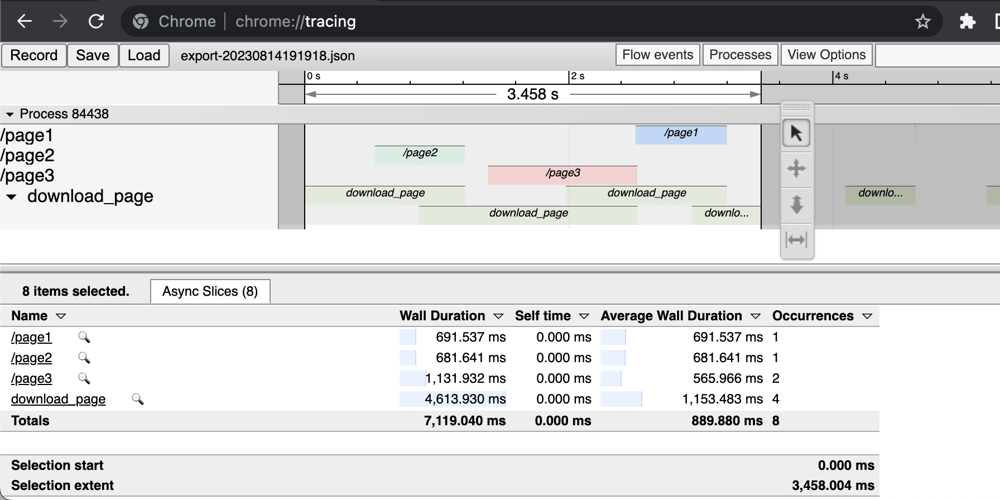

LocalTracer
==

[](https://ukrainewar.carrd.co/)

Low-effort tracer of hand-picked code flows.




Installation
--

### Swift Package Manager

Add package dependency:

```swift
.package(url:"git@github.com/paiv/local-tracer-swift.git", .branch:"main"),
...
.dependencies(["LocalTracer"])
```


Usage
--

```swift
let storage = LocalTracerInMemoryEventStorage()
let tracer = LocalTracer(storage: storage)

let trace = tracer.traceStart("name", category: "category")
tracer.traceEnd(trace)

tracer.exportEventsAndResetStorage()
```

See Examples for practical tracing.


Export format
--

The exported JSON document adheres to [Trace Event Format][F1], and can be rendered in
[chrome://tracing](chrome://tracing).

[F1]: https://docs.google.com/document/d/1CvAClvFfyA5R-PhYUmn5OOQtYMH4h6I0nSsKchNAySU/ "Trace Event Format"